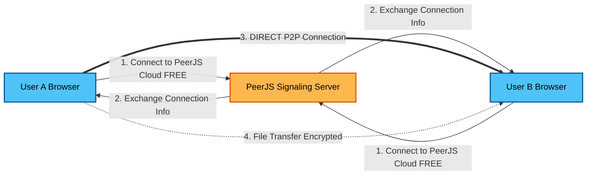

# 🔒 Sharencrypt - Secure P2P File Sharing with WebRTC

**A 100% FREE, secure peer-to-peer file sharing application using WebRTC for direct browser-to-browser connections.**

Perfect for final year projects, demos, and privacy-focused file sharing! 🎓

[](LICENSE)
[](https://peerjs.com/)
[](https://webrtc.org/)

---

## ✨ Features

✅ **Unlimited & Secure** - Share 100GB+ files directly via WebRTC with AES-GCM encryption. No servers, no tracking.
✅ **Background Zipping** - Dropped folders are automatically zipped in a background thread for lag-free performance. ⚡
✅ **Smart Connectivity** - Intelligent auto-retry logic with STUN/TURN traversal ensures 99% global success rates. 🌐
✅ **Power User Tools** - Paste anywhere (**Ctrl+V**) to send, drag & drop folders, or scan QR codes for instant mobile pairing. 🚀
✅ **True Peer-to-Peer** - Direct browser-to-browser connection. No data touches the cloud. 🔒
✅ **Cosmic Glass UI** - A premium, responsive implementation using React 18, Tailwind, and Framer Motion. 🎨

---

## 🎯 Perfect For

- 🎓 **Final Year Projects** - Complete P2P implementation
- 📚 **Academic Demonstrations** - Learn WebRTC, encryption, P2P networking
- 🔐 **Privacy-Focused Sharing** - No data touches any server
- 🌍 **Global Collaboration** - Share files across continents
- 💻 **Development Learning** - Modern React, TypeScript, WebRTC, Web Workers

---

## 🚀 Quick Start

### Prerequisites

- 📌 **Node.js 14.x** or higher
- 📌 **npm** or **yarn**
- 📌 **Modern Browser** (Chrome, Firefox, Edge, Safari)

### Installation

1️⃣ **Clone the repository:**
```bash
git clone https://github.com/pragnesh-singh-rajput/Sharenrypt-p2p-file-sharing.git
cd Sharenrypt-p2p-file-sharing
```

2️⃣ **Install dependencies:**
```bash
npm install
```

3️⃣ **Start the development server:**
```bash
npm run dev
```

4️⃣ **Open in browser:**
```
http://localhost:5173
```

**That's it! No server setup needed!** 🎉

---

## 🏗️ How It Works

### WebRTC P2P Architecture

Sharencrypt uses **WebRTC** for direct peer-to-peer connections:



### Advanced Optimization

1. **Web Workers**: Heavy tasks like Zipping (for iOS compatibility) and Encryption run in a background thread, keeping the UI silky smooth, even for 1GB+ transfers.
2. **Smart Caching**: The app forces fresh content (NetworkOnly) to avoid stale PWA caches, ensuring you always see the latest peers.
3. **Connection Hardening**: Deduplication logic prevents "double connecting" race conditions.

---

## 🌐 100% FREE Services Used

| Service | Purpose | Limit | Cost |
|---------|---------|-------|------|
| **PeerJS Cloud** | Signaling server | Unlimited | FREE ✅ |
| **Google STUN** | NAT traversal | Unlimited | FREE ✅ |
| **OpenRelay TURN** | Connection fallback | Community-run | FREE ✅ |
| **Netlify/Vercel** | Frontend hosting (optional) | Generous free tier | FREE ✅ |

**Total monthly cost: $0** 💰

---

## 🔒 Security

### Multi-Layer Encryption

1. **DTLS Encryption** (Built into WebRTC)
   - All data automatically encrypted by WebRTC
   - Same encryption as HTTPS (TLS 1.2+)
   
2. **AES-GCM 256-bit** (Application Layer)
   - Files encrypted before sending
   - Unique keys per transfer session
   - Web Crypto API (browser-native)

3. **No Server Storage**
   - Files never stored on any server
   - Only peer browsers have access
   - Perfect forward secrecy

---

## 🎮 Usage

### Power User Features

📋 **Clipboard Paste**:
- Take a screenshot (Win+Shift+S or Cmd+Shift+4)
- **Ctrl+V** anywhere on the app dashboard
- The image is instantly sent to your connected peer!

� **Smart Batching**:
- Drag an entire folder
- It automatically zips in the background (using Web Workers)
- Sends as a single zip file (Perfect for iphone recipients)

📱 **Mobile Connect**:
- Open Connection Dialog
- Click **Scan QR**
- Scan your friend's code for instant pairing

---

## 📁 Project Structure

```
Sharencrypt/
├── src/
│   ├── App.tsx                 # Main React component
│   ├── components/             # Reusable UI components
│   │   ├── ConnectionDialog.tsx # With QR Scanner
│   │   ├── FileList.tsx        
│   │   └── QRScanner.tsx
│   ├── hooks/
│   │   └── usePeerConnection.ts  # Core P2P Logic Hook
│   ├── services/
│   │   ├── peer/
│   │   │   ├── ConnectionManager.ts # Connection Retry Logic
│   │   │   └── TransferManager.ts   # Chunking & Streaming
│   │   └── historyService.ts   # LocalStorage History
│   ├── workers/
│   │   ├── encryption.worker.ts # Background Encryption
│   │   └── zip.worker.ts        # Background Zipping
│   ├── utils/
│   │   ├── encryption.ts       # AES-GCM
│   │   └── sounds.ts           # Audio Feedback
│   └── types.ts                # TypeScript Interfaces
├── .env                        # Environment Config
├── vite.config.ts              # Vite & PWA Config
└── README.md
```

---

## 🔧 Configuration

All services are **PRE-CONFIGURED** with free options in `.env`:

```env
# PeerJS Cloud (FREE, no signup)
VITE_PEER_HOST=0.peerjs.com
VITE_PEER_SECURE=true

# Google STUN (FREE)
VITE_STUN_SERVER_1=stun:stun.l.google.com:19302

# App Settings
VITE_MAX_FILE_SIZE=1073741824  # 1GB Limit (Configurable)
VITE_ENABLE_SOUND=true         
```

**Everything works out of the box - no configuration needed!** ✅

---

## 🎓 Perfect for Final Year Projects

### Why This Project Stands Out

✅ **Modern Tech Stack** - React 18, TypeScript, Vite, Tailwind  
✅ **Advanced Engineering** - Web Workers, Stream API, Wake Lock API  
✅ **Real-World Problem** - Functioning P2P file sharing  
✅ **Cutting-Edge** - Zero-knowledge encryption, NAT traversal  
✅ **Clean Code** - Modular architecture (Services, Hooks, Workers)  

---

## 📜 License

This project is licensed under the **GNU Affero General Public License v3.0 (AGPL v3.0)** - see the [LICENSE](./LICENSE) file for details.

This ensures that any network deployment of this software must also make the source code available to its users.

---

## 👥 Authors

### Vishvam Joshi  
[](https://github.com/vishvam12a)
[](https://linkedin.com/in/vishvam-j-joshi) 
[](https://instagram.com/vishvam.joshi.71)

### Pragnesh Singh  
[](https://github.com/pragnesh-singh-rajput)
[](https://linkedin.com/in/pragnesh-singh-rajput) 
[](https://instagram.com/pragnesh_singh_rajput)

### Hardik Singh  
[](https://github.com/singhhardik531)
[](https://linkedin.com/in/hardik--singh) 
[](https://instagram.com/imhardiksinghh)

---

## 🌟 Star This Repo!

If you found this project helpful, please give it a ⭐ on GitHub!

**Made with ❤️ for secure, private, and fast file sharing**

---

## 📈 Stats


**Happy Sharing! 🚀🔒**
